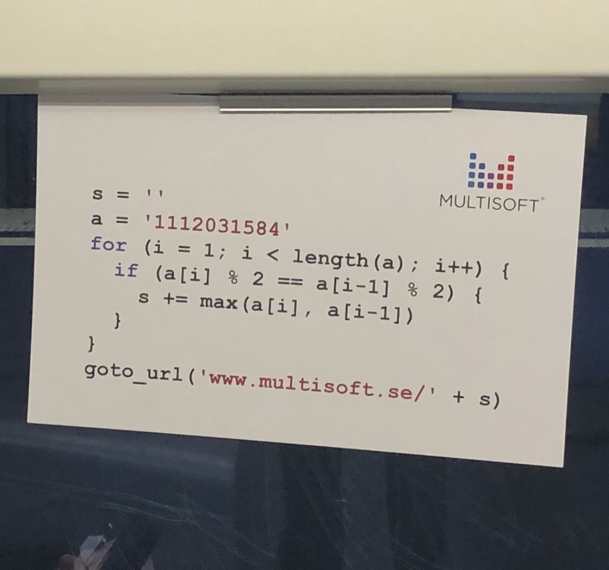

Multisoft
===

#beginner #print #string #interview #recruiting #technical #technical-interview #test #training

## 📑 Overview

This is a solver to the swedish software company "Multisoft" technical test from tweeter : https://twitter.com/egzolinas/status/1445067068630609924

Result should be : https://www.multisoft.se/112358

## 📚 Implementation Details

This class prints the highest number of each two consecutive even or two consecutive odd numbers found in a string.

